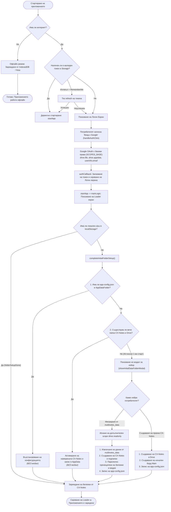

Viewed c:\dev\Projects\SeeNotes\uni\logonFlow.md:2-101
Ran command: `git status`

Ето актуалната графика и подробно описание на обновения **Logon Flow**:

---

### Основни подобрения в новия flow:

1. **Без фалшиви модали за съществуващи потребители:**
   * Дори при изчистен кеш, ново устройство или инкогнито прозорец, след Google вход първо се проверяват `AppDataFolder` и наличната папка `CX-Notes`. Ако потребителят вече има настроени данни, приложението ги зарежда веднага **без да пита нищо**.
2. **Първо вход, после избор:**
   * Модалът се показва **само и единствено** ако акаунтът никога досега не е използван с CX-Notes (няма папка `CX-Notes` и няма `app-config.json`).
3. **Инкрементални права (Incremental Consent):**
   * Всички потребители се логват първоначално само с безопасни базови права (`drive.file`). Допълнителното право за четене (`drive.readonly`) се изисква само при изричен избор за мигриране от `multinotes_data`.
4. **Правилен визуален тайминг:**
   * Логин екранът се скрива незабавно след Google входа, а целият процес по проверка/миграция се визуализира в лоудъра на приложението.