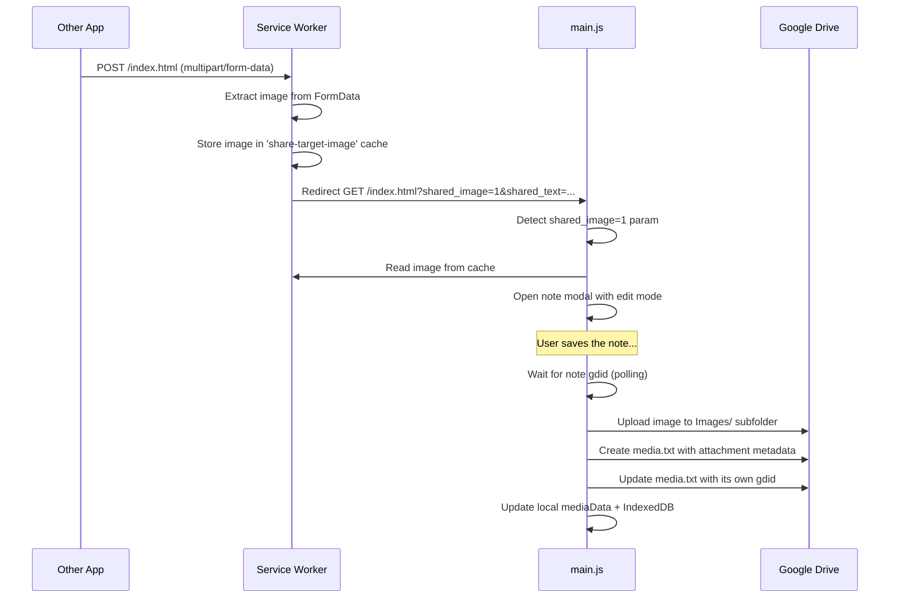

# Share Target: Image Sharing Implementation

## Overview
Added support for sharing images to the PWA via the Web Share Target API. When a user shares an image from another app, CX Notes receives it, creates a new note, uploads the image to Google Drive, and creates a `media.txt` attachment entry linking them.

## Architecture Flow



## Files Changed

### 1. `manifest.webmanifest`
- Changed `method` from `GET` to `POST`
- Added `enctype: "multipart/form-data"`
- Added `files` array accepting `image/*`

### 2. `sw.js`
- Added POST handler in the `fetch` event listener
- Extracts `FormData` from the POST request
- Stores the shared image in a dedicated `share-target-image` cache
- Redirects to GET with text params + `shared_image=1` flag
- Protected `share-target-image` cache from deletion during SW activation

### 3. `main.js`
- **`uploadBlobToGDrive()`** — New function for uploading binary blobs to GDrive (mirrors `createGDriveFile` pattern with token refresh)
- **`handleShareTarget()`** — Now `async`, handles both text and image shares:
  1. Retrieves image blob from the SW cache
  2. Opens note modal for editing
  3. After user saves note → polls for note's gdid
  4. Uploads image to `Images/` subfolder in GDrive
  5. Creates `media.txt` entry linking image to note
  6. Updates local `mediaData` and IndexedDB

### 4. `i18n-bg.json` / `i18n-en.json`
- Added: `sharedContentReceived`, `uploadingSharedImage`, `sharedImageSaved`

## media.txt Format
```json
{
  "datemod": 1769823393360,
  "description": "",
  "gdid": "<ID of this media.txt file>",
  "id": 139,
  "noteid": "<gdid of parent note.txt>",
  "path": "",
  "pathGD": "<gdid of image file in Images/>",
  "type": 1
}
```

> [!IMPORTANT]
> The image attachment is only created after the user saves the note (to get its gdid). A polling mechanism waits up to 30 seconds for the note to be saved.
